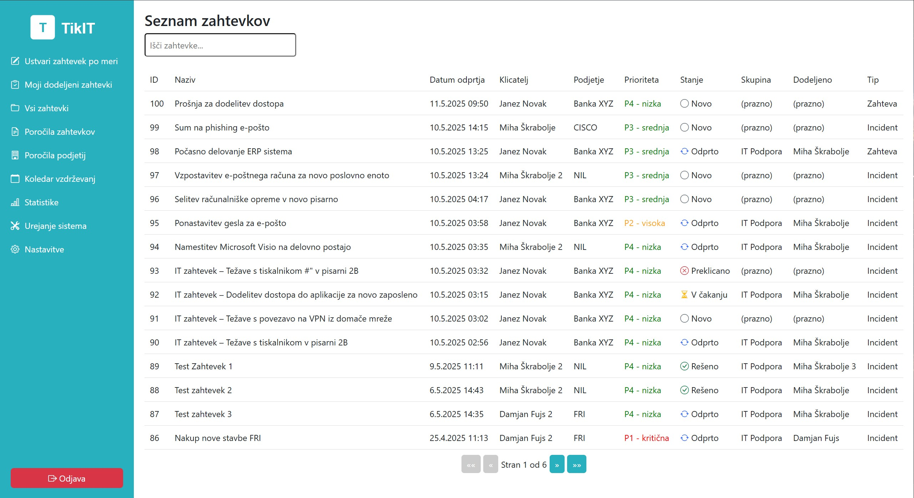
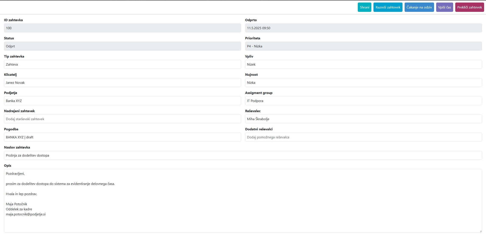
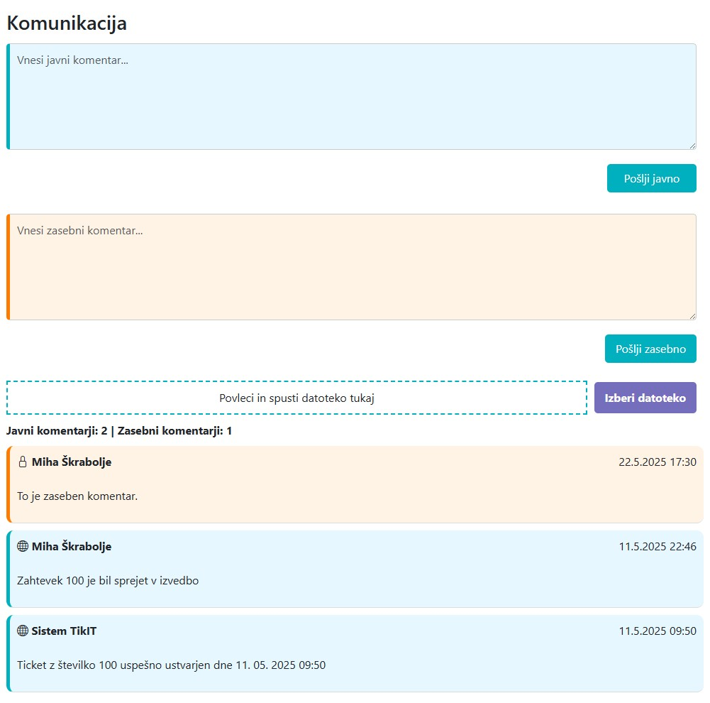
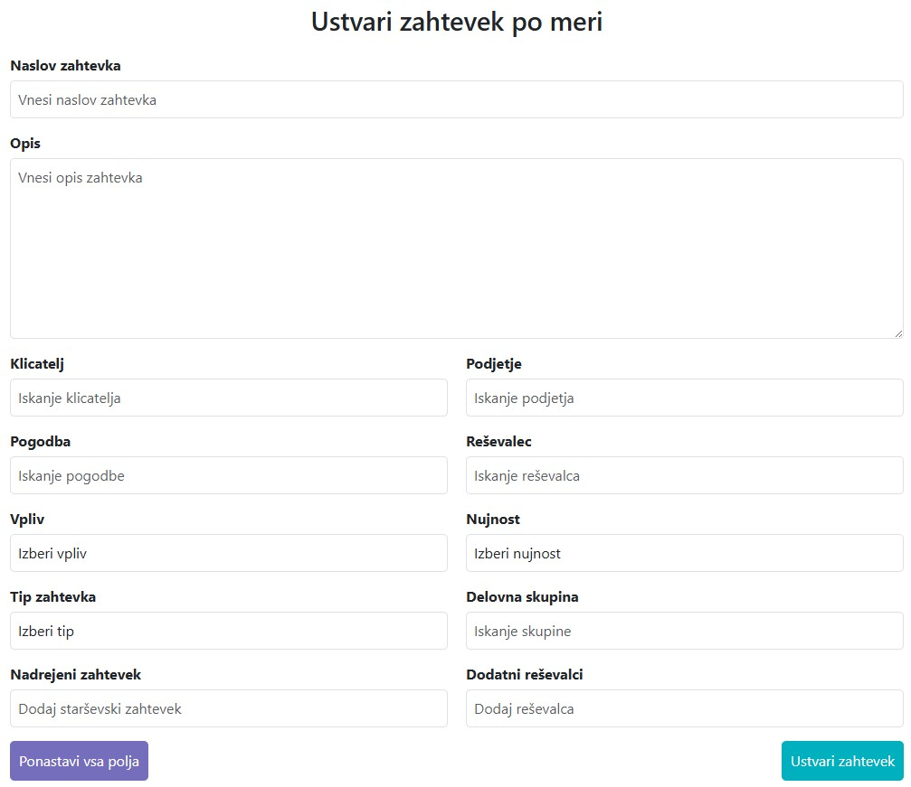
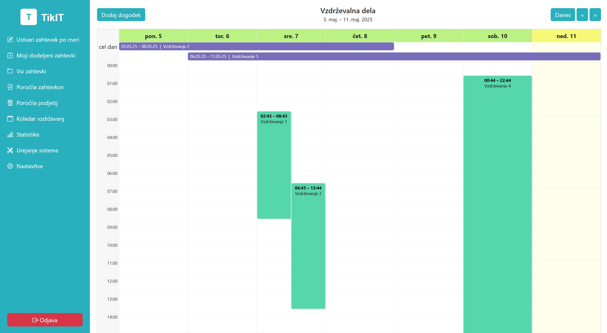
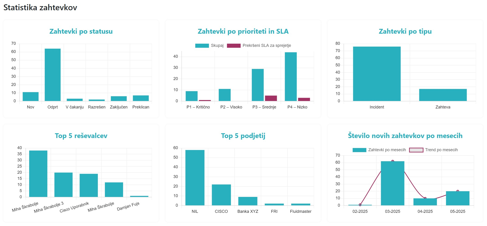
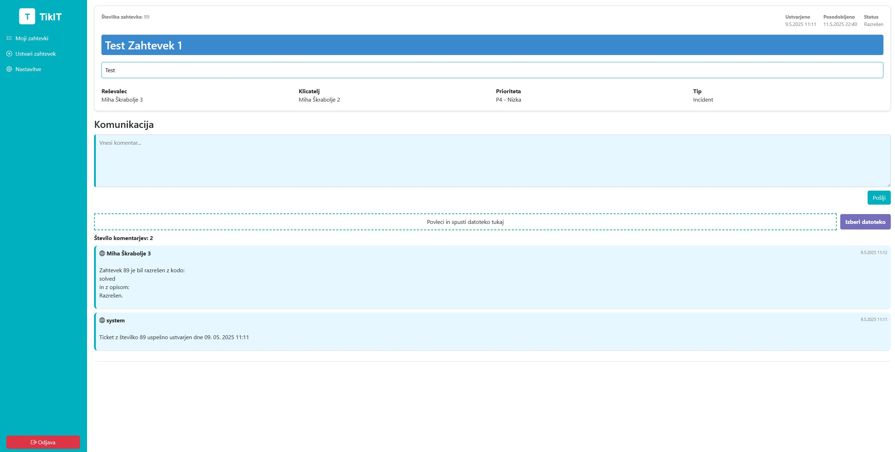
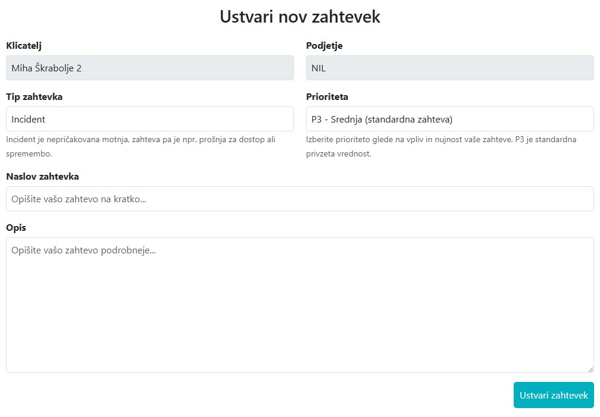

# TikIT – Enostaven sistem za upravljanje IT zahtevkov

TikIT je odprtokodni sistem za upravljanje IT zahtevkov (*IT ticketing system*), razvit za potrebe manjših in srednje velikih slovenskih organizacij. Glavni poudarek je na enostavni uporabi, sodobnem dizajnu, popolni lokalizaciji v slovenščino in minimalizmu – brez nepotrebnih funkcionalnosti, ki bremenijo večje komercialne rešitve.

Projekt je bil razvit kot del diplomske naloge na Fakulteti za računalništvo in informatiko UL.

## 🎯 Namen sistema

TikIT omogoča hitro evidentiranje, obdelavo in sledenje IT zahtevkov v organizaciji. Cilj sistema je zmanjšati kompleksnost, ki jo prinašajo večji komercialni sistemi (npr. Jira, ServiceNow), ter ponuditi:

- prijazen in odziven uporabniški vmesnik,
- najnujnejše funkcionalnosti brez nepotrebne navlake,
- popolno lokalizacijo v slovenski jezik,
- odprto kodo za prilagajanje po meri uporabnika.

## ⚙️ Ključne funkcionalnosti

### Zahtevki (Ticketi)
- Ustvarjanje, urejanje, dodeljevanje in spreminjanje statusa
- SLA časovniki (sprejem) z indikatorji
- Možnost komentarjev (zasebni/javni)
- Zgodovina dogodkov in statusov

### Komunikacija in sledenje
- Vgrajen real-time chat med uporabnikom in operaterjem (Socket.IO)
- Obvestila ob spremembah
- Integracija in obveščanje tudi preko emailov

### Poročila in statistike
- PDF izvoz posameznega zahtevka
- Mesečno poročilo po podjetju
- Vizualne statistike (status, prioritet, operaterjev, trendov)

### Vloge uporabnikov
- **Uporabnik:** ustvarja in spremlja zahtevke
- **Operater:** rešuje, komentira in dodeljuje zahtevke
- **Administrator:** nadzoruje sistem, uporabnike in SLA

### Uporabniški vmesnik
- Sidebar navigacija
- Odzivnost za mobilne naprave
- Bootstrap in prilagojena barvna shema (TikIT design)

## 🚀 Primer uporabe

1. Uporabnik odda zahtevek za pomoč (npr. "Težava z dostopom do VPN").
2. Operater dobi obvestilo, dodeli zahtevek in se odzove z komentarjem.
3. Če zahtevek ni sprejet pravočasno, se sproži SLA opozorilo.
4. Rešitev je zabeležena, poraba časa shranjena.
5. Uporabnik prejme obvestilo in lahko pogleda zgodovino vseh aktivnosti.

## 🔧 Tehnologije

| Plast       | Tehnologije                                 |
|-------------|---------------------------------------------|
| Frontend    | Vue 3, TypeScript, Pinia, Axios, Bootstrap  |
| Backend     | Node.js, Express, TypeScript, JWT, Socket.IO|
| Baze        | PostgreSQL (glavna), MongoDB (komentarji)   |
| Avtorizacija| JWT (access & refresh tokens), bcrypt       |
| Varnost     | Helmet, CORS, SQL injection prevention       |
| PDF         | html2pdf.js                                 |
| Prikaz SLA  | lastna logika + časovniki (setInterval)     |

## 🖼️ Posnetki zaslona

### Pogled operaterja
#### Pregled vseh zahtevkov

#### Podrobnosti zahtevka

#### Komunikacija v zahtevku

#### Ustvarjanje novega zahtevka

#### Koledar vzdrževanj

#### Prikaz statistike

### Pogled uporabnika
#### Podrobnosti zahtevka

#### Ustvarjanje novega zahtevka

